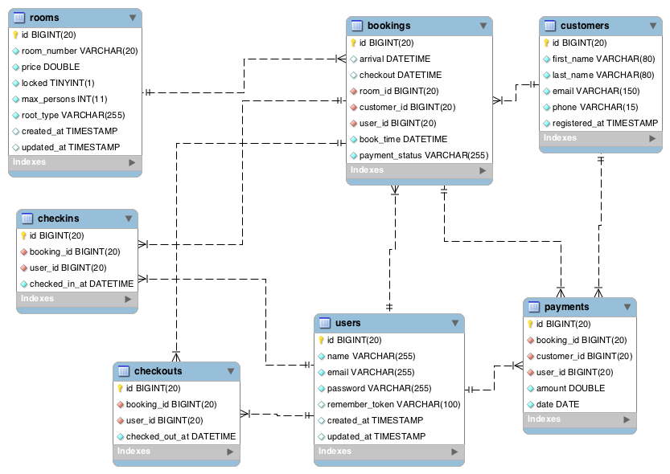

# Booking System
```git clone https://github.com/almamuncsit/booking-system.git```

## On the terminal or command prompt to the the project folder and run the following composer command
```composer install```

## Configure database
There is a `.env` file on the root folder open the `.env` file and update database information.
```
DB_DATABASE=booking
DB_USERNAME=root
DB_PASSWORD=
```
Update Database name username and password or create database following this information.

## Configure Redis for Caching
Update the following ENV variable for redis caching. Make sure that your machibe has redis installed. 
```
REDIS_HOST=127.0.0.1
REDIS_PASSWORD=null
REDIS_PORT=6379
REDIS_CLIENT=predis
```

## Run migrations for creating database
`php artisan migrate`

## Create some fake data using seeder
`php artisan db:seed`

### There is a JWT_SECRET on .env file if you create new .env file the run the following command.
`php artisan jwt:secret`

## Run the application
Run the following command on the project root directory.

```php -S localhost:8000 -t public```

# Import the following JSON file fo Postman for testing the API from root folder. 
 `project.postman_collection.json`
 
 
 ## Add an environment with following variable
 Value of auth_token will be the auth token return from jwt login end point
 
 ```
api_endpoint = http://localhost:8000/api/v1
auth_token = paste_the_token_from_login_response
```

# API Documentation
[https://documenter.getpostman.com/view/5772299/TVssjobN](https://documenter.getpostman.com/view/5772299/TVssjobN) 


# Running Unit Test
`phpunit` has been used for unit testing. So please make sure that `phpunit` is installed on your computer.

Go to the project root folder run the following command for running unit tests.

`phpunit`

If `phpunit` don't have installed on your computer then run the following command.

`vendor/phpunit/phpunit/phpunit`

# Database ERD
